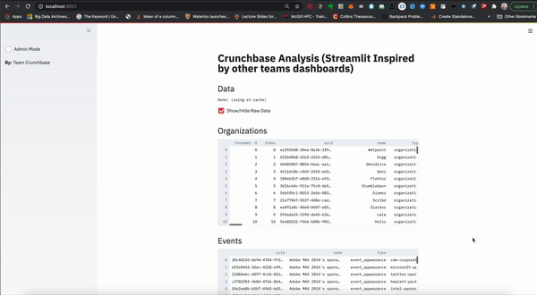
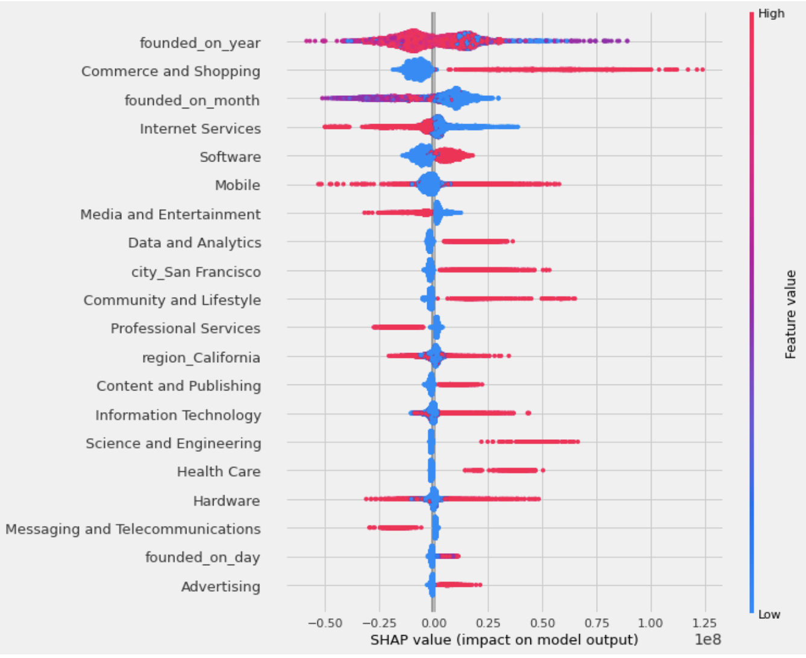

# Data
The data contains startups from crunchbase. The data is greatly unbalanced (In addition, alot of startups fail and are never reported on here). Startups have information such as amount raised, whether or not they are still operating, acquired as well as descriptions, categories. The folder also contains employee and investor data. 

# Objective
The objective is to see if we can determine which startups will fail, which will be acquired/succeed and in what area of expertise they are in. These areas of expertise usually change over time. Ie. recently the verticals "Regtech" and "Digital ID" are becoming more and more popular. Given that there is no existing labels for these startups we can use semi-supervised algoirthms to label them ourselves. The purpose of crunchbase is for investors to get a glimpse at the most up to date startup data. Investors soemtimes have different definitions on trends, therefore this may serve useful in both predicting a companies relevance to an investors definition of a "vertical" as well as potential success. 

# Preprocessing
Startups need to be companies.
 In addition we will need to find the acquired companies for companies with status “acquired” for multi-label classification.
In addition we should see if removing the date has any effect. 
Also we need to ensure that company size must not be included as this data is updated constantly.
We must also create features such as potential competition stats.
Look at employee data stats/diversity.

# Exploration
You can check out our app for data exploration (the use of the library streamlit which is used is heavily inspired by another group's app). Run it by streamlit run profile_report.py 

# Prediction

We can do labelling on our own at first for the super verticals (ie. cybersecurity) -> we need to 
identify these from the groups_list we can do clustered semi-supervised ml for this.

We can also use Casual ML to find causal relationships between failure.

TPOT can also be used to create a baseline model.

What we want to perdict is: Status, Super Vertical (ie. Cybersecurity)

# Results
We conclude educaton, location, founded timing, and verticals indeed have a significant effect on the funding and operating status. We use Causalml as well as Randomforest feature importance to visualize this. We found using clustered semi-supervised learning did not result in good results. Recall was the most important accuracy measure, however optimizing for recall ended up having a poor performance on our test set. We conclude that more data needs to be collected for a precise model.

Sample Visualization:

